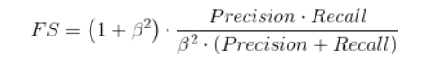

今天这一part我们来看一下机器学习中常用的模型评估与选择。

# 1.模型评估

## 1.1 准确率ACC
我们通常使用准确率来衡量一个分类问题的结果好坏，准确率的精准定义是**正确分类样本占总样本的个数**。

$$Acc=\frac{y_{true}}{y_{total}}$$

### 1.1.1 准确率Acc的拓展--top K Acc
通常来说对于分类问题，数据经过一个机器学习模型产生的输出会是一个概率分布，我们会把概率最高的那个类别视为模型预测的类别，那么普通准确率的计算就是用这个类别来进行计算

但是普通准确率对于模型的概括并不算特别全面，举个例子：

对于当前有5类的数据集，预测一个数据的类别，该数据的真实标签是第二类，然后有两个模型，其预测的概率分布分别为
$$[0.35,0.25,0.1,0.1,0.2]$$
$$[0.35,0.05,0.15,0.25,0.2]$$

用普通准确率去算的话两个模型都是一样的表现，但是非常明显的是，第一个模型虽然概率最高的不是真实标签第二类，但是概率第二高的是第二类，而第二个模型对于数据判断为第二类的概率是最小的。明显看来，第一个模型应该是好一点。**这个意思有点像大家都没考到100分，但是我80分，你40分，我比你牛逼的感觉**

所以为了照顾这种情况，会引入一种新的准确率 top K Acc，**其意义为前K个概率最高的类别中含正确样本的比例**，
对于上面的例子，如果取top 2 acc，那么第一个模型的准确率就是100%。

**当然比起普通准确率，虽然这个topk acc考虑的更加全面，但是多了k这个参数，k取太小跟普通acc没区别，k取太大条件过于宽泛，会把不好的模型与较好的模型等价**

### 1.1.2 准确率Acc的扩展---加权Acc

那么所谓加权Acc通常应用在不平衡的数据上。**一个非常形象的例子就是小学数学考98分 和大学高等数学考98分 不是一个级别的，前者平平无奇，后者直呼大佬**。
这个例子带给我们的启示就是相同的acc在不同的数据上代表的含义不一样。详细来说，在数据不平衡问题上，对于有较多数据的类别，你学到的东西比较多，所以你这个应该错的几率要更小，所以这个类别的acc含金量不是特别高。而对于较少数据的类别，你学到的东西比较少，错了可以理解，但是对了应该大加赞赏，所以这个类别的acc含金量会更高。

**总的而言加权acc就是根据数据的分布来给予不同类别不同的权重得到最后的acc值**

## 1.2 查准率，查全率与F1 score

准确率是非常流行的模型评估的方法，但是其也有其局限的地方。

### 1.2.1 召回率（查全率）
先引入计算公式

$$Recall= \frac{TP}{TP+FN}

我们了解一下公式就行，抛开公式，现在是深入了解这个召回率

**比如说，对于一个智慧医疗系统，你说判断为有病并且判断错的问题大还是判断为没有病并且判断错的问题大。这两者是不等价的，但是准确率对于这两者在计算中是视为等价的**

这时我们可以引入一个召回率对该智慧医疗系统进行一个评估。所谓召回率就是针对一个类别，**你预测为该类别的样本数** 与 **真正为该类别的样本数**的比例，说白了就是该样本你召回了多少。

以上面的例子为例，以对有病病人的召回率来看，分母是什么？**真正确实有病的病人**。而对于病人的有病，医院可能给出两者结果，一是判断出你有病，二是判断出你没病（判断错了），而**判断出有病就对应你预测为该类别**，所以召回率的计算为
$$ 召回率=\frac{判断出有病（判断对了）}{判断出有病（判断对了）+判断出没病（判断错了）}$$

要想提高召回率，就是减少判断出没病，但实际上有病的可能性

**一句话总结，不可错漏！！**

### 1.2.2 精确率（查准率）
$$Precision=\frac{TP}{TP+FP}
我们了解一下公式就行，抛开公式，现在是深入了解这个召回率

**还是医疗系统的例子，召回率保证了你不会出现你确实有病，但是不会被判断出来的事情，就是肯定不会错漏任何一个有病的人。但是现在啊有人举报医疗系统管你有没有病都给你开药，怀疑再赚黑心钱。那么我们现在就要一个精确率来对医疗系统进行一个评估**

所谓精确率就是针对一个类别，**你判断样本为这个类别且判断正确的样本数**与**你判断样本为这个类别的样本数**的比例。一句话来说，就是你判断的精度有多高。注意要与准确率分别开来，一个类别的准确率是这样定义的 ，**你判断样本为这个类别且判断正确的样本数**与**样本为这个类别的样本数**的比例。可以看到精准率是根据你的判断来定的。

以上面的例子为例，精准率我们可以这么算
$$精准率= \frac{判断为有病且确实有病}{判断为有病且确实有病+判断为有病但是没病}$$

要想精准率高，就是降低判断为要病但是没病的概率，总的来说，你要判断的准。

**一句话总结，不可错杀**

### 1.2.3 F1 score
某人云，宁可错杀不可错漏，也有某人云，宁可错漏不可错杀。那么问题来了，究竟是不可错漏还是不可错杀呢？引申而来就是精确率与召回率谁重要呢？

所以又引入了一个新的指标，其代表的是精准率和召回率的平衡，也就是不错漏也不错杀。

### 3者总结
那么这三个指标没有谁好谁坏，不同的场景不同的要求会选用更加合适的指标。

## 1.3 ROC和AUC

### 1.3.1 ROC曲线
引入式子：

$$TPR=Recall$$

$$FPR=\frac{FP}{FP+TN}$$

而我们现在有个ROC空间，x轴是FPR，而Y轴是TPR，那么首先我们先来解释一下FPR和TPR把。

首先TPR不用多说，等于召回率。而FPR代表的是与召回率相反的意思，**预测为正实际为负的样本数占实际为负的所有样本数的比例**

那么对于这个ROC空间，每个点代表得都是当前分类情况的FPR和TPR的值。那么为什么会有一个空间呢？

**那是因为存在很多种分类情况！那为什么存在很多种分类情况呢？**

以三个数据的模型输出为例  【0.3，0.5，0.7】，现在是个二分类问题，输出是个概率分布，那么我问你，根据模型的输出，你能分别判断出这三个数据是什么类别吗？
答案自然是不能的，**因为判断类别我们是需要阈值，也就是说当概率值大于这个阈值，我们可以说这个数据是正类，否则为负类，这也说明了为什么存在多种分类情况。**

所以ROC曲线实质上是当前输出的概率分布在不同分类阈值下出现的各种分类情况的点的连线而已。

当然有人说了0-1有无穷个值，那岂不是有无数个点，也就是有无数个分类情况吗？那当然也不是，仍然以【0.3，0.5，0.7】，取0.3到0.5内任意一个阈值，最终都会是第一个数据为负类，第二个第三个为正类。**所以也就是当阈值从0开始取起，直到取到1，仅当阈值取到概率值【0.3，0.5，0.7】里的任意一个时，才会发生一个突然的变化，其余都是不变的，都是一个重复的点**

所以画ROC曲线，取阈值为输出概率里的每一个值，然后一个点，最后将所有点连在一起，就是ROC曲线了

那么假设我们当前场景是希望召回率TPR和FPR越大越好，然后我们知道阈值的选取其实是一个超参数，很多人在训练模型时，都会忽略分类阈值这种超参数，而阈值选取通常是一个比较重要的后处理，不同的阈值可能会带来非常不一样的结果。

如果现在有两个模型，前者的ROC曲线包含了后者模型的ROC曲线，我们可以说前者模型肯定比后面好，为什么呢？这是因为不管后者选择怎么的分类阈值，哪怕是效果最好的分类阈值都比不上前者模型随便的一个分类阈值。

但是如果两个模型的ROC曲线有交叉，这就说不好了，因为别人可能在那个分类阈值表现的好，而你在某个分类阈值表现的好，这就没有一个可比性，总不能短处碰长处把，这不公平。

**所以ROC曲线并不是一个特别明显可以比较模型好坏的评价指标，但是其好处就是对于不平衡的数据分布，表现的也会比较好。**

### 1.3.2 AUC
AUC代表的是ROC曲线下的面积，那么AUC是个比较明显能够判断模型好坏的指标。为什么呢？因为我们说过我们希望TPR和FPR越大越好。

那么由于不同的分类阈值会导致不同的TPR和FPR，我们不能只看一种分类阈值，所以我们就可以这么想，我们也不比较一个一个点了，我们就看所有分类阈值下TPR的平均值行不行，看FPR的平均值行不行，可以把！那么基于这个思想，有什么可以同时考虑x，y值的大小嘛，那就是面积把！

所以我们就比较ROC曲线下的面积，就可以直接比较模型的好坏了。

